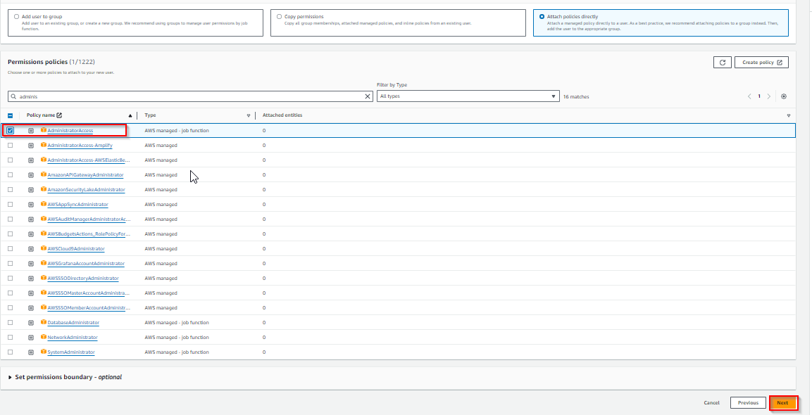
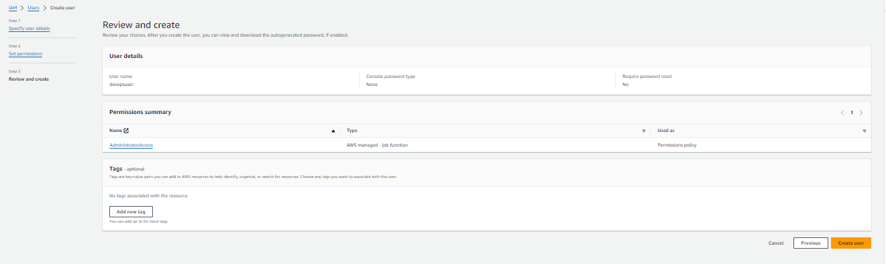
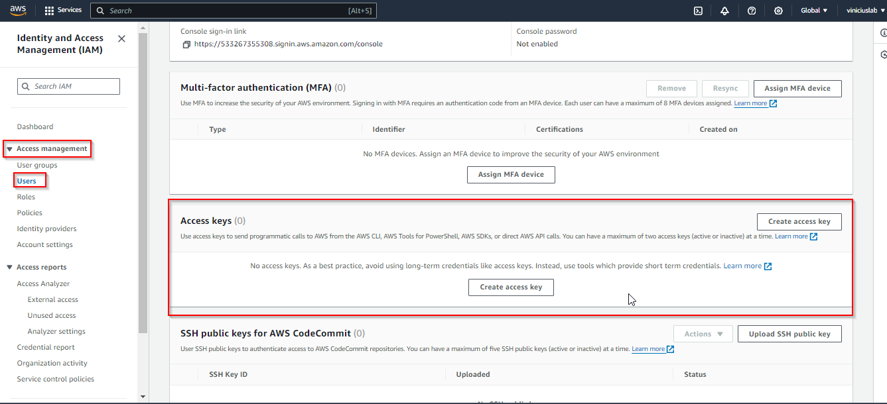
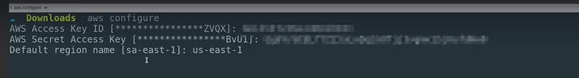
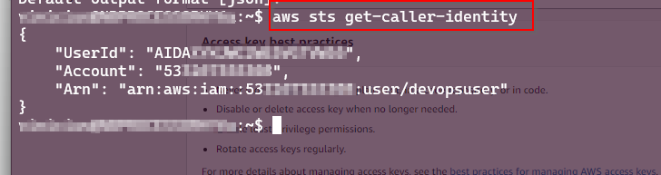

# Introdução

1. Criação de conta na AWS
   - Vamos usar o free tier, mas é provável que tenhamos alguma pequena cobrança de uso de serviços da AWS que não são contemplados pelo  free tier.

2. Instalação e Configuração do AWS Cli
   - Instalamos o Cli apartir do link: https://docs.aws.amazon.com/cli/latest/userguide/getting-started-install.html#getting-started-install-instructions

   Como eu já tenho o AWS Cli instalado, ao rodar o comando adicionei a flag de atualização.

   ```sh
    unzip awscliv2.zip
    sudo ./aws/install --update
   ```

   - Criamos um usuário de serviço. Seguimos a doc: https://docs.aws.amazon.com/IAM/latest/UserGuide/id_users_create.html

   - Adicionamos provisóriamente a permissão total para esse usuário administrara nossa conta da AWS. Este usuário não deverá ter acesso ao console. Então não marcamos a opção que libera este acesso.

      
      
    
   - E geramos o token para se conectar com este usuário na AWS. Seguindo a doc: https://docs.aws.amazon.com/IAM/latest/UserGuide/id_credentials_access-keys.html
   
      
      

3 - Usando a credencial. Abrimos o terminal, e digitamos o comando de inicialização do AWS Cli.

   ```sh
      aws configure
   ```
   
   

   E por final, com o comando a seguir, validamos o usuário logado. Doc: https://docs.aws.amazon.com/cli/latest/reference/sts/get-caller-identity.html

   ```sh
      aws sts get-caller-identity
   ```
           
   


# Arquitetura do Projeto

## Visão Geral

A arquitetura do projeto consiste em uma VPC na região `us-east`, com duas zonas de disponibilidade (`us-east-1a` e `us-east-1b`). Cada zona de disponibilidade possui uma sub-rede privada e uma sub-rede pública. As sub-redes públicas contêm um Nat Gateway (NGW) e são conectadas a um Internet Gateway (IGW). As sub-redes privadas são conectadas às sub-redes públicas através do Nat Gateway.


## Revisão
VPC (Virtual Private Cloud)
  A VPC é o contêiner principal que engloba todos os recursos de rede, como subnets, gateways e load balancers. Dentro da VPC, os recursos podem se comunicar entre si, conforme as regras de roteamento e segurança definidas.

IGW (Internet Gateway)
  Função: Permitir que os recursos dentro da VPC se comuniquem com a Internet.
Comunicação:
  Subnets públicas dentro da VPC têm rotas direcionadas ao IGW para permitir a comunicação com a Internet.
    Recursos nas subnets públicas, como instâncias EC2 com IPs públicos, podem se comunicar diretamente com a Internet através do IGW.
  NGW (NAT Gateway)
    Função: Permitir que recursos em subnets privadas tenham acesso à Internet de saída sem expor seus endereços IP privados.
Comunicação:
Subnets privadas têm rotas direcionadas ao NGW para acesso à Internet.
O NGW se comunica com o IGW para permitir a saída para a Internet.
Recursos em subnets privadas (como instâncias EC2 sem IPs públicos) usam o NGW para acessar a Internet para atualizações de software ou downloads, por exemplo.
ALB (Application Load Balancer)
Função: Distribuir o tráfego de aplicações (HTTP/HTTPS) entre várias instâncias de backend para balancear a carga e melhorar a disponibilidade.
Comunicação:
Recebe tráfego da Internet ou de outras fontes (se configurado em subnets públicas) e distribui para instâncias EC2 ou outros recursos em subnets públicas ou privadas.
Pode se comunicar com o IGW diretamente se estiver em uma subnet pública.
NLB (Network Load Balancer)
Função: Distribuir tráfego de rede de baixo nível (TCP, UDP) com alta performance e baixa latência entre instâncias de backend.
Comunicação:
Recebe tráfego da Internet ou de outras fontes e distribui para instâncias EC2 ou outros recursos em subnets públicas ou privadas.
Pode se comunicar com o IGW diretamente se estiver em uma subnet pública.
Exemplo de Comunicações:
Internet para VPC:
IGW: Permite que o tráfego da Internet chegue a subnets públicas.
ALB/NLB: Distribuem o tráfego de entrada da Internet para instâncias EC2 ou outros recursos.
VPC para Internet:
IGW: Permite que os recursos com IPs públicos em subnets públicas enviem tráfego para a Internet.
NGW: Permite que os recursos em subnets privadas enviem tráfego de saída para a Internet.
Intercomunicação dentro da VPC:
Subnets privadas e públicas podem se comunicar diretamente com base nas regras de roteamento e políticas de segurança definidas.
ALB pode distribuir o tráfego de subnets públicas para instâncias em subnets privadas, permitindo acesso controlado a recursos internos.


### Diagrama da Arquitetura


```plaintext
                     +------------------+
                     |  VPC: us-east    |
                     +------------------+
                             |
               +-------------+-------------+
               |                           |
      +--------+--------+          +--------+--------+
      |  us-east-1a     |          |  us-east-1b     |
      |                 |          |                 |
      |  +----------+   |          |  +----------+   |
      |  |  Private |   |          |  |  Private |   |
      |  |  Subnet  |   |          |  |  Subnet  |   |
      |  +----------+   |          |  +----------+   |
      |                 |          |                 |
      |  +----------+   |          |  +----------+   |
      |  |  Public  |   |          |  |  Public  |   |
      |  |  Subnet  |   |          |  |  Subnet  |   |
      |  +----------+   |          |  +----------+   |
      |        |        |          |        |        |
      |       NGW       |          |       NGW       |
      |        |        |          |        |        |
      +--------+--------+          +--------+--------+
               |                           |
               +-------------+-------------+
                             |
                            IGW
```

## Explicações:

VPC -> Maior nivel de rede. Como se fosse nosso datacenter de rede.
   - Inclusive, podemos rotear 2 VPC's de contas diferentes(peering de redes) para que ambas compartilhem o trafego. Ou melhor, para que uma consiga acessar a outra.

   - Requisitos de VPC para EKS:
     - Precisamos ter no mínimo 2 sub-nets para o EKS(ele precisa de pelo menos 2 sub-nets em 2 zonas de disponibilidades). Mas o ideal seria termos 3 us-east.
     - https://docs.aws.amazon.com/eks/latest/userguide/network_reqs.html#network-requirements-vpc


Sub-net -> Quem atribui o IP para os recursos.
   - Sub-net publica -> Cada recurso possui um endereço IP público. Qualquer um pode acessar. Sua rota vai diretamente para o IGW
     - As sub-net's públicas geralmente rodam os ALB/NLB
     - As sub-net's públicas não devem ser vinculadas a recursos tipo, banco de dados, aplicações, ou Nodes.
   - Sub-net privada ->

### Nomenclaturas
VPC => Virtual Private Cloud
   - https://aws.amazon.com/pt/vpc/

ALB => Application Load Balancer
   - https://aws.amazon.com/pt/elasticloadbalancing/application-load-balancer/

NLB => Network Load Balancer
   - https://aws.amazon.com/pt/elasticloadbalancing/network-load-balancer/

NGW => NAT Gateway
IGW => Internet Gateway


## Diagrama de comunicação

```plaintext
Internet --- IGW --- Public Subnet --- ALB/NLB --- Private Subnet
                    |                     |
                    |                     +--- EC2 (sem IP público)
                    +--- EC2 (com IP público) 
                    
Internet --- IGW --- Public Subnet --- NGW --- Private Subnet
                                   |               |
                                   +--- EC2 (sem IP público)

```

GW conecta a Internet às subnets públicas.
ALB/NLB distribuem tráfego entre instâncias EC2 nas subnets.
NGW permite que instâncias EC2 em subnets privadas acessem a Internet sem terem IPs públicos.


Outros conceitos de redes: https://aws.amazon.com/pt/products/networking/

## Artigos
   AWS — Difference between Internet Gateway and NAT Gateway
      - https://medium.com/awesome-cloud/aws-vpc-difference-between-internet-gateway-and-nat-gateway-c9177e710af6